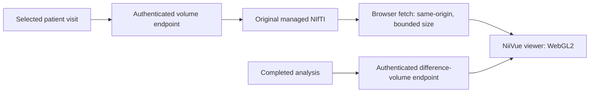

# 3D MRI Workspace Handoff

## Purpose and current state

This document hands off the implemented 3D MRI workspace in NeuroPredict AI to the next teammate. The viewer is integrated into the patient analysis workspace and renders the selected visit's actual MRI data. The implementation is documented in [`docs/11-3d-visualization.md`](docs/11-3d-visualization.md).

The viewer uses NiiVue 0.69.0 with WebGL2. It provides interactive 3D volume rendering and orthogonal slices for research review. This is visualization software; it does not extract anatomical regions or validate a clinical measurement.

## User-facing behavior

- Render and rotate/zoom a visit's MRI in 3D.
- Show axial, coronal and sagittal slices, individually or in a four-view layout.
- Navigate slices with controls and view coordinates.
- Adjust orientation, camera preset, intensity window, colormap and opacity.
- Apply axial, coronal or sagittal cutaway clipping.
- Compare the selected visit with baseline, including linked navigation and camera controls.
- Optionally display an analysis-generated intensity-difference volume, adjusting overlay opacity and display threshold.
- Reset the view, open fullscreen and export a PNG snapshot with a research disclaimer.
- Show loading and failure states. If WebGL2 is unavailable or fails, explain the issue and retain the existing 2D MRI preview.

## Architecture and data flow



The API serves original `.nii` or `.nii.gz` files through authenticated, researcher-owned routes. The client bounds volume downloads at 100 MiB and uses the response bytes to select the NIfTI loader name. MRI is not sent to an external service.

Analysis may create a per-visit absolute intensity-difference volume against baseline. It is a finite float32 volume on a normalized 64 × 64 × 64 grid, with an affine mapping the grid into the selected scan's canonical field of view. That mapping preserves display geometry; it does not register visits anatomically. Older analysis records may lack this artifact. The UI should report that case as unavailable and direct the user to rerun local inference.

## Code map

| Responsibility | File |
|---|---|
| Viewer controls, selected/baseline visits, comparison and overlay state | [`frontend/components/volume-explorer.tsx`](frontend/components/volume-explorer.tsx) |
| NiiVue creation, NIfTI loading, rendering, event callbacks and canvas lifecycle | [`frontend/components/volume-canvas.tsx`](frontend/components/volume-canvas.tsx) |
| Viewer types, camera/clipping presets, bounded fetch, appearance, cleanup and PNG export | [`frontend/lib/volume-viewer.ts`](frontend/lib/volume-viewer.ts) |
| Embeds the viewer in the patient analysis experience | [`frontend/components/analysis-workspace.tsx`](frontend/components/analysis-workspace.tsx) |
| Authenticated source MRI and difference-volume routes | [`backend/app/api/routes.py`](backend/app/api/routes.py) |
| NIfTI validation, orientation, normalization, preview and analysis input preparation | [`ml/preprocessing.py`](ml/preprocessing.py) |
| Analysis artifacts, including intensity-difference volumes | [`ml/inference.py`](ml/inference.py) |
| MRI and generated artifact contracts | [`docs/03-data-contract.md`](docs/03-data-contract.md) |
| Validation requirements | [`docs/07-testing-validation.md`](docs/07-testing-validation.md) |

NiiVue is pinned in [`frontend/package.json`](frontend/package.json). The selected library and alternatives are recorded in the 3D visualization design document.

## Data and interpretation limits

- The MRI is structural head imaging and includes non-brain tissue. Volume rendering and clipping do not skull-strip it.
- No tissue or anatomical segmentation, cortical reconstruction, atlas labeling, tractography, hippocampus volume, cortical thickness or ventricle volume is produced by this workspace.
- The overlay is an image-intensity difference proxy. It is not registered change, measured atrophy, Grad-CAM or an explanation of the trained classifier.
- Viewer alignment and linked coordinates follow image headers; linked navigation does not establish anatomical registration.
- Keep research provenance and limitations visible in the UI and exported snapshot. This is not a clinically validated tool.

## Resource and security requirements

- Keep MRI and difference-volume requests authenticated and enforce the existing researcher ownership checks.
- Do not expose storage keys or host paths in browser responses.
- Validate volume URL shape, response status and download size; preserve explicit expired-session and unavailable-artifact messages.
- Abort stale downloads and dispose of NiiVue instances, callbacks and WebGL resources when a visit changes or the viewer unmounts.
- Retain the current cap of two active WebGL contexts for baseline comparison.
- Preserve the 2D fallback and context-loss recovery behavior.
- Do not add database tables for the 3D feature; existing visit MRI keys and analysis artifact records are used.

## Handoff checklist

1. Read root [`AGENTS.md`](AGENTS.md), [`docs/00-index.md`](docs/00-index.md), and the relevant product, data, UI and testing documents before changing behavior.
2. Run the local app with the existing backend, worker, database and frontend setup. The viewer needs authenticated API access and a browser with WebGL2 for full 3D interaction.
3. Use a prepared OASIS visit to check source MRI loading, slices, 3D rotation/zoom, clipping, window/opacity/colormap, baseline comparison, difference overlay, visit switching and PNG export.
4. Also check mobile layout, no-WebGL behavior, context-loss recovery, stale-request cleanup, API ownership and legacy analyses without difference artifacts.
5. Keep any new segmentation or morphometry work as a separately specified and validated processing pipeline; the viewer alone cannot generate those measurements.

## Documented verification

[`docs/11-3d-visualization.md`](docs/11-3d-visualization.md) records successful checks for five prepared OASIS cases (15 visits), source/difference volume endpoints and geometry, WebGL rendering and rotation, controls, context-loss recovery, no-WebGL fallback, desktop/mobile rendering, PNG export and no external HTTP requests. The record also notes the associated automated checks. These are prior project results, not checks rerun while writing this handoff.

The documented commands, to run from the project root when making or validating a code change, are:

```powershell
npm --prefix frontend run typecheck
npm --prefix frontend test
npm --prefix frontend run test:e2e
.\.venv\Scripts\python -m ruff check backend ml scripts tests
.\.venv\Scripts\python -m pytest -q
```

Playwright browser checks require the local stack, prepared data and Microsoft Edge. See [`docs/07-testing-validation.md`](docs/07-testing-validation.md) for the full acceptance checklist and test prerequisites.
